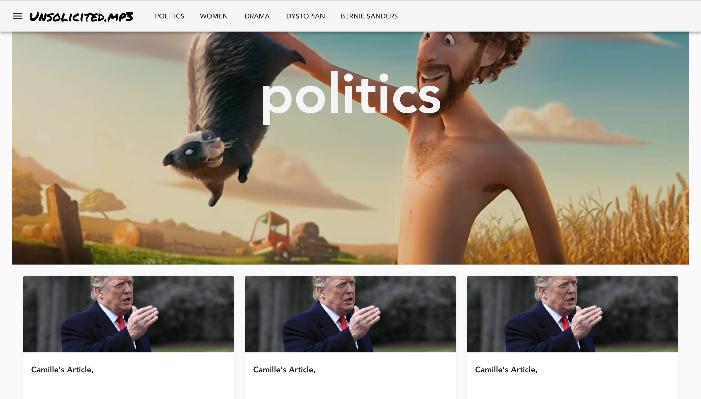

# Art Culture News Outlet
## Description
This repo contains source code for the *Art Culture News Outlet* created with Vuejs, Express, Mongodb, Nodejs. To replicate this project download or clone the repo and follow these steps:

1. Navigate to *client* directory and perform `npm install` to install the packages
2. Navigate to the *server* directory and perform `npm install` to install the packages
3. In both directores, (client, server) run the command `npm start`
3. Download and install mongodb and setup the db account
4. On mac edit the mongod.conf file `vim /usr/local/etc/mongod.conf` and copy the following contents to vim in terminal: 
```
systemLog:
	destination: file
path: /usr/local/var/log/mongodb/mongo.log
	logAppend: true
storage:
	dbPath: /usr/local/var/mongodb
net:
	bindIp: 127.0.0.1
```
5. To start mongodb run: `brew services start mongodb` or run `mongodb --dbpath "/usr/local/var/mongodb"`

## Screenshots
### Home Page


<br>
### Side Bar


<br><br>
### Tag View


<br><br>
### Article View


<br><br>
### Admin View

<br>


<br>


<br>


<br>


<br>


<br>


